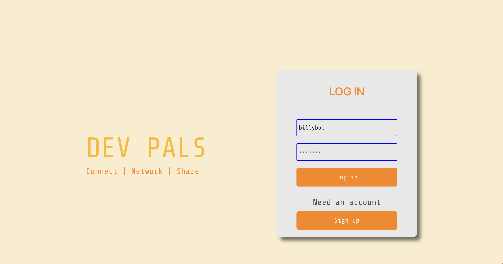

# dev-pals
## Social media for Developers

## Members:
* Will Isenberg https://github.com/kingwilldabeast/dev-pals
* Leon Hinds https://github.com/lhinds86
* Azalea Nikitin https://github.com/AzaleaTopaz
* Parker Pace https://github.com/parpace

## Description:

This is a social media platform that will allow users to do the following: (AAUIWT)

* Create a new account with username and password on sign-in page
* Login to existing account with username and password
* Edit user information after logging in 
* Create posts
* Comment and upvote posts

Stretch Goals:
* Upload images from computer
* Comments on comments
* Befriend other users with bi-directional relationship where each user has an array of friends and appears in their list as well

Team Member duties:
* Parker: user profile page, posts, comments
* Leon: login page, CSS
* Azalea: signup page
* Will: edit user info page

Friday: (all members)
* set up all files and import everything
* plan ERD and components and models/schemas 
* set up all models and controllers in backend
* define editing permission rules in GitHub

Monday:
* Parker: user profile page
* Leon: login page password confirm
* Azalea: sign in page
* Will: edit user info

Tuesday:
* Parker: making posts
* Leon: login page CSS
* Azalea: sign in page password validator
* Will: able to delete account

Wednesday:
* Parker: upvoting posts
* Leon: profile page CSS
* Azalea: sign in page modal
* Will: research password hashing and validating

Thursday:
* Parker: making and upvoting comments
* Leon: edit page CSS
* Azalea: sign in page modal, continued
* Will: research password hashing and validating

Technologies used:
* JavaScript
* CSS/HTML
* Mongoose
* Express
* React
* Node.js (npm)

### Screenshots

Sign up:

Sign up modal:

Login in:

Profile Page

Edit Info:

### Component Hierarchy Diagram (frontend):

 

### Entity relationship Diagram (backend):

### Wireframe:

Trello project: https://trello.com/b/kXzXRxpJ

