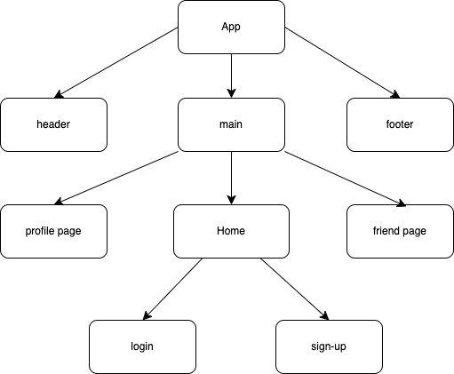

# dev-pals
## Social media account project

## Members:
* Will Isenberg https://github.com/kingwilldabeast/dev-pals
* Leon Hinds https://github.com/lhinds86
* Azalea Nikitin https://github.com/AzaleaTopaz
* Parker Pace https://github.com/parpace

## Description:

This is a social media platform that will allow users to do the following: (AAUIWT)

* Create a new account with username and password on sign-in page
* Login to existing account with username and password on log-in page
* Edit user information after logging in 
* Create posts, tweets, and (upload images stretch goal??)
* Edit one's own posts and tweets
* View the information and posts and tweets of other users (friends) without being able to edit their details
* Comment/reply on one's own or other's posts and tweets (but not comments upon comments)
* Upvote or downvote posts/tweets/comments

Stretch Goals:
* Upload images from computer
* comments on comments
* befriend other users with bi-directional relationship where each user has an array of friends and appears in their list as well

Technologies used:
* JavaScript
* CSS/HTML
* Mongoose
* Express
* React
* Node.js (npm)

Component Hierarchy Diagram (frontend):

 

Entity relationship Diagram (backend):

Trello project: https://trello.com/b/kXzXRxpJ

